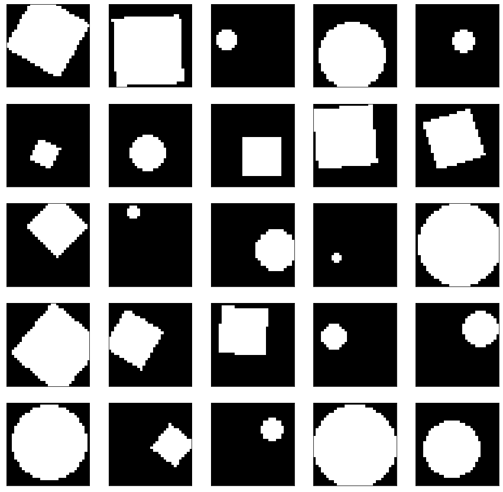

# Toy-Object-Verification

**Objective:**  
Train a classifier designed to take two images as input and predict whether the shapes depicted in them are identical.

### 1. Data Details

Each image is 32x32 pixels and contains either a circle or a square with random size, position, and rotation angle. The training set includes 5,000 images of squares and 5,000 images of circles to enable evaluation on unseen data, while the validation set has 1,000 images of each. For efficiency, only the parameters for sample generation are stored rather than the actual images. The target is represented by a binary label: **1** if the shapes in the pair are identical, and **0** if they differ.

### 2. Proposed Approaches  

| Architecture                        | Merging Method                                                       | Loss                                               |
|-------------------------------------|----------------------------------------------------------------------|----------------------------------------------------|
| **Approach 1.1: Metric Learning**   | Distance metrics (e.g., cosine similarity, L2 norm, L1 norm)         | Contrastive loss / Triplet loss (if using triplets) |
| **Approach 1.2: Vector Merging**      | Concatenation                                                        | Binary Cross-Entropy (BCE)                         |
| **Approach 1.2: Vector Merging**      | Element-wise multiplication                                          | Binary Cross-Entropy (BCE)                         |
| **Approach 1.2: Vector Merging**      | Element-wise difference/sum                                            | Binary Cross-Entropy (BCE)                         |
| **Approach 1.2: Vector Merging**      | Bilinear pooling (Bilinear Pooling)                                  | Binary Cross-Entropy (BCE)                         |
| **Approach 2: Cross-Attention**       | Cross-attention applied to feature maps                              | Binary Cross-Entropy (BCE) or appropriate classification loss |
| **Approach 3: Dynamic Models**        | [Not specified]                                                      | [Not specified]                                    |

### Project Layout

**Core Notebooks:**
- **part1_data_generation.ipynb**  
  Visualizes objects with varying parameters (size, position, and rotation angle for squares) to determine constraints for the generation parameters. Also generates training, validation, and test datasets.
- **part2_train_coattention_model.ipynb**  
  Trains the proposed model that incorporates co-attention and self-attention mechanisms.
- **part3_analysis_results.ipynb**  
  Evaluates the model's performance on the test dataset.

**Additional Components:**
- **generate_dataset.py**  
  A script for dataset generation.
- **src/models/**  
  Contains the models used for this task.
- **src/utils/**  
  Contains utility functions and helper scripts.
- **data/**  
  Contains the saved splits for the train, validation, and test datasets.
- **weights/**  
  Contains experiment folders with the saved best weights.
   
